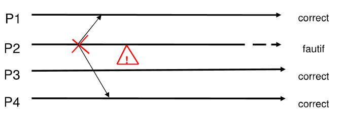
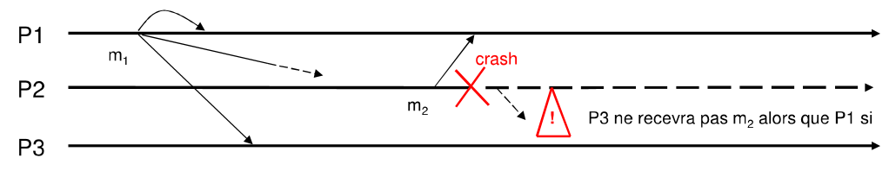
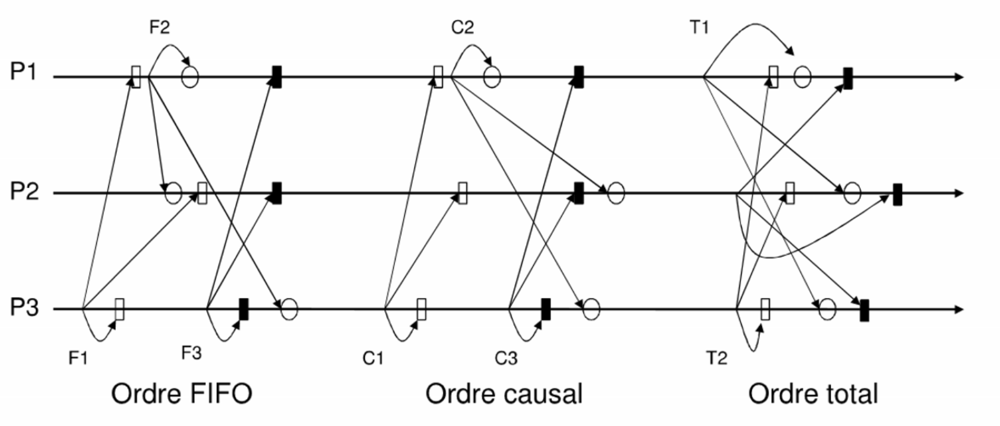

# Broadcasts

## Primitives
* `broadcast(m)` : p broadcasts `m` to the group
* `deliver(m)` : delivers m to p

## Issues
Ensure two properties:
- delivery guarantee
- ordering guarantee

## Delivery guarantees
### Best-effort
With best-effort broadcast, the burden of ensuring reliability is only on the sender. Therefore, the remaining processes do not have to be concerned with enforcing the reliability of received messages.
On the other hand no delivery guarantees are offered in case the sender fails. Best-effort broadcast is characterized by the following three properties:
- _validity_ is a liveness property, where _p1_ and _p2_ are correct, a message _m_, broadcasted by _p1_ eventually gets delivered by _p2_, whereas the;
- _no duplication_ property, ensuring that messages get delivered at most once, and the;
- _no creation_ property, where only message broadcasted by a process, are safety properties

They descend  directly from the corresponding properties of perfect point-to-point links. Note that broadcast messages are implicitly addressed to all processes. Remember also that messages are unique, that is, no process ever broadcasts the same message twice and furthermore, no two processes ever broadcast the same message.

```
Process P :
  BestEffort_broadcast(m)
    send m to all including me

upon recv(m) :
    BestEffort_deliver(m)
```


### Reliable broadcast (_fiable_)
Best-effort broadcast ensures the delivery of messages as long as the sender does not fail. If the sender fails, some processes might deliver the message and others might not deliver it. In other words, they do not _agree_ on delivery of the message. Ensuring agreement even when the sender fails is an important property for many practical applications that rely on broadcast. The abstraction of _(regular) reliable broadcast_ provides exactly this stronger notion of reliability.

#### Specification
Intuitively, the semantics of a reliable broadcast algorithm ensure that the correct processes agree on the set of messages they deliver, even when the sender of the messages crash during the transmission. It should be noted that a sender may crash before being able to transmit the message, in which case no process will deliver it.
- _validity_ if a correct process broadcasts message _m_ then all correct process delivers _m_
- _agreement_ if a correct process delivers message _m_ then all the correct members deliver _m_
- _completeness_ Messages are delivered at most once to every correct process, if it was broadcasted by a process

#### Idea
__If one correct process delivers the broadcasted message _m_, every correct process delivers _m_.__

#### Algo
```
Process P: 
  Local Variable: 
    rec= new();

    real_bcast(m) 
      timestamp m with sender_id and sequence #
      send m to every process
    
    upon recv(m) do
      if m not in rec 
        rec.add(m)
      if sender(m) != P 
        send m to every process but P
      real_deliver(m)
```

#### Summary
- [+] No need for fault detection 
- [+] Algo works in any temporal model
- [-] Bad perf, `n(n-1)` messages per bcast
- [-] Makes it useless irl
- [x] No guarantees of order 




### Uniform Reliable broadcast (_fiable uniforme_)

With regular reliable broadcast, the semantics just require the _correct_ processes to deliver the same set of messages, regardless of what messages have been delivered by faulty processes. In particular, a process that rb-broadcast a message might rb-deliver it and then crash, before the best-effort broadcast abstraction can even beb-deliver the message to any other process. There are cases where such behavior causes problems because even a process that rb-delivers a message and later crashes may bring the application into a inconsistent state.
We now introduce a stronger definition of reliable broadcast, called _uniform reliable broadcast_. This definition is stronger in the sense that it guarantees that the set of messages delivered by _faulty_ processes is always a _subset_ of the messages delivered by correct processes. Many other abstractions also have such _uniform_ variants. 

Uniformity ensures compliance of specifications to both correct and faulty processes. 

#### Specs 
- _validite_ si un processus correct diffuse le message _m_, alors tous les processus corrects delvirent _m_.
- _accord uniforme_ si un processus (__correct__ ou __fautif__) delivre le message _m_, alors tous les membres corrects delivrent _m_,
- _integrite uniforme_ Un message _m_ est delivre au plus une fois a tout processus (__correct__ ou __fautif__), et seulement s'il a ete diffuse par un processus  

## Order guarantees

### FIFO
The spicification of reliable broadcast does not state anything about the order in which multiple messages are delivered. A FIFO-order is one of the simplest possible orderings and guarantees that messages from the same sender are delivered in the same sequence as they were broadcast by the sender. Note, this does not affect messages from different senders. 
The FIFO-order (reliable) broadcast abstraction is obtained from the (regular) reliable broadcast abstraction by extending it with the FIFO delivery property. A uniform variation of FIFO-order (reliable) broadcast with causal order can be obtained in the same way. For brevity we usually skip the term reliable refer to a FIFO-order broadcast abstraction.

### Causal
The _causal order_ property for a broadcast abstraction ensures that messages are delivered such that tehy respect all cause-effect relations. The happenned-before relation expresses all such dependencies. This relation is also called the _causal order_ relation, when applied to messages exchanged among processes and expressed by broadcast and delivery events. In this case, we say that a message `m1` may have _potentially caused_ another message `m2`, denoted as `m1 -> m2`, if any of the followint relations apply: 
- some process `p` broadcasts `m1` before it broadcasts `m2`
- some process `p` delivers `m1` and subsequently broadcasts `m2`; or
- there exists some message `m'` such that `m1 -> m'` and `m' -> m2`

As is evident from the first condition of causal order, the _causal delivery_ property implies the _FIFO order_ property. Hence, a causal-order broadcast primitive provides also FIFO-order reliable broadcast.

Both causal and FIFO orders are only partial orders; there's no properties about the delivery order for concurrent bcasts

### Total
The messages are delivered in the same order to all the destinaties. 
