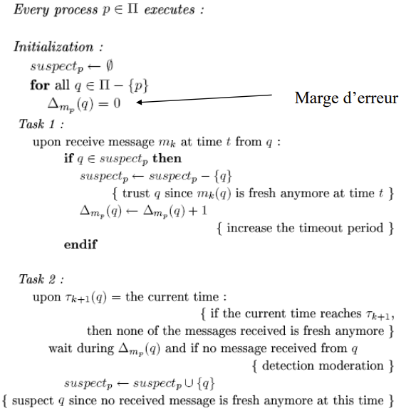
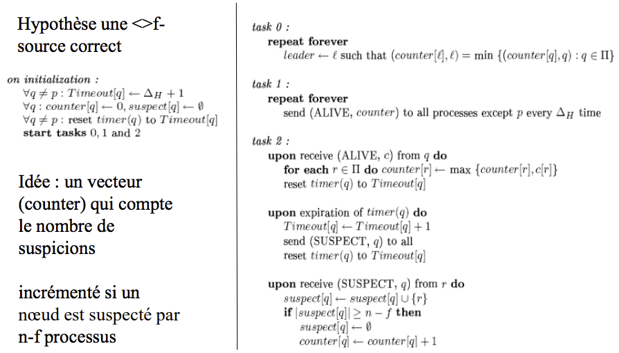
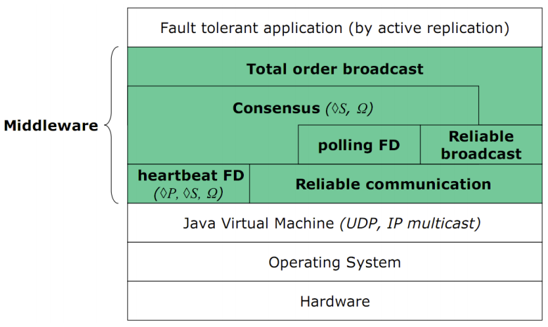
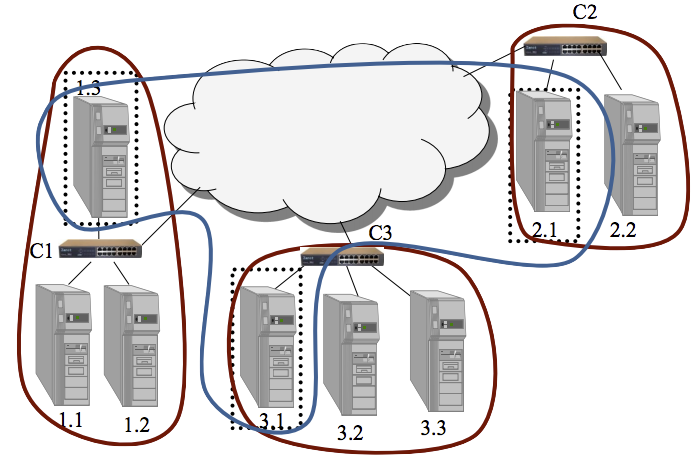
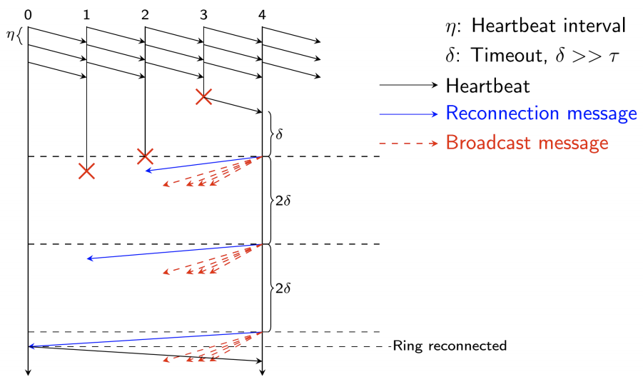
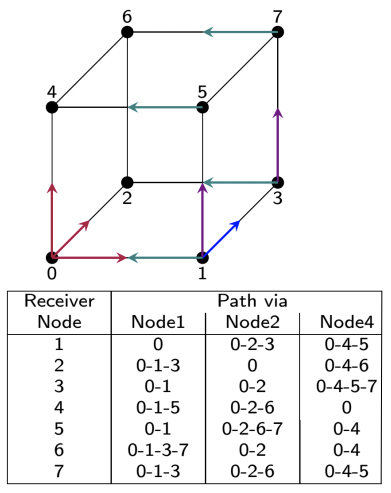

- [Why care about concensus](#why-care-about-concensus)
- [Specification](#specification)
    - [Consensus](#consensus)
    - [**Uniform** Consensus](#uniform-consensus)
    - [Primitives](#primitives)
        - [`propose(v)`](#proposev)
        - [`decide(v)`](#decidev)
- [Modele](#modele)
    - [Types de fautes](#types-de-fautes)
        - [Processus](#processus)
        - [Canaux](#canaux)
    - [Modeles temporels - `(a)sync`](#modeles-temporels---async)
        - [Modele synchrone](#modele-synchrone)
        - [Modele asynchrone](#modele-asynchrone)
        - [Modeles partiellement synchrone](#modeles-partiellement-synchrone)
    - [Contourner FLP](#contourner-flp)
        - [Changer le probleme](#changer-le-probleme)
        - [Systemes partiellement synchrones [DDS87]](#systemes-partiellement-synchrones-dds87)
        - [Consensus imparfait](#consensus-imparfait)
- [Detecteurs des fautes](#detecteurs-des-fautes)
    - [Specs](#specs)
        - [Completude (completness)](#completude-completness)
        - [Justesse (accuracy)](#justesse-accuracy)
        - [Detecteurs de defaillance non fiables [CHT96]](#detecteurs-de-defaillance-non-fiables-cht96)
        - [Hypotheses temporelles](#hypotheses-temporelles)
            - [Pour ♦P](#pour-%E2%99%A6p)
                - [Algo ♦P](#algo-%E2%99%A6p)
            - [Pour ♦S et Ω](#pour-%E2%99%A6s-et-%CF%89)
                    - [Algo Ω](#algo-%CF%89)
    - [Detecteur ∑](#detecteur-%E2%88%91)
    - [FD Minimum](#fd-minimum)
    - [Architecture](#architecture)
    - [Algo1 - Consensus avec P](#algo1---consensus-avec-p)
    - [Algo2 - Consensus avec P](#algo2---consensus-avec-p)
    - [Algo3 - Consensus avec ♦S](#algo3---consensus-avec-%E2%99%A6s)
        - [How it works](#how-it-works)
- [Scaling Fault-Detectors](#scaling-fault-detectors)
- [FD in HPC](#fd-in-hpc)
    - [FD](#fd)
    - [Reconnecting the ring](#reconnecting-the-ring)
    - [Broadcast algo - Hypercube](#broadcast-algo---hypercube)

# Why care about concensus
- whether to commit a tx to a db 
- agree on the id of a leader 
- state machine replication 
- atomic broadcasts
- clock synchronization 
- PageRank
- smart power grids
- load balancing
- many other

# Specification 

## Consensus

- `validité (validity)` si un processus décide `v` alors `v` est une valeur proposée
- `terminaison (termination)` tous les processus corrects decident finalement
- `coherence (agreement)` deux processus corrects ne peuvent decider differemment 
- `integrite (integrity)` un processus doit decider au plus une fois

Consensuls resoluble avec ♦S. En effet ♦S est le plus faible detecteur pour resoudre le consensus (minimalite) avec une **majorite de processus corrects**.

## **Uniform** Consensus 
- as above plus; 
- No two processes (whether faulty or not) decide differently

## Primitives

### `propose(v)`

le processus appelant propose une valeur initiale `v`

### `decide(v)`

le processus appelant décide `v`


```
 propose(4)      decide(7)
    v                v
-------------------------------->
 
 propose(4)     decide(7)
    v               v
-------------------------------->
 
 propose(4)         decide(7)
    v                   v
-------------------------------->
```

# Modele

## Types de fautes 

- `correct` : ne défaille pas pendant toute la dureé de l'exécution
- `fautif` : pas correct 

### Processus

- `franche (crash)` : le processus fautif n'emet plus ni ne recoit de message de facon _permanente_ -> silence sur defaillance (_fail-silent_), variante faute-visible (_fail-stop_)
- `omission` : transitoire 
- `temporaire` : trop tot ou trop tard
- `Byzantin` : malveillance

```
.______________________________.
|__________________. Byzantine |
|_______. omission |           |
| crash |          |           |
|_______|__________|___________|
```

### Canaux

- `Fiable (reliable)` : si `p` execute `send(m)` vers `q` et `q` _est correct_, alors `q` recevera `m`
- `Quasi-fiable (quasi-reliable)` : si `p` execute `send(m)` vers `q` et, `p` et `q` _sont corrects_, alors `q` recevera `m`
- `Equitable (fair-lossy)` : si un processus correct envoie un message `m` a `q` une infinite de fois, alors `q` recevera `m`

## Modeles temporels - `(a)sync`

### Modele synchrone

- `Borne delta (Δ) sur le temps de transmission` si un processus `p` envoie un message vers `q` a l'instant `t`, alors `q` recoit le message avant `t+Δ`
- `Borne phi (Φ) sur la vitesse relative des processus` si le processus le plus rapide prend `x` unites de temps pour un traitement, alors le processus le plus lent ne peut pas prendre plus `xΦ` temps pour faire le meme traitement

Permet une detection parfaite

```
     |    2Δ + xΦ   |
     |------------->|
p -------------------------------->
     | u alive?     |^ aha
      \.            /
q -------------------------------->
```

### Modele asynchrone

- Pas de borne sur les delais de transmission 
- Pas de borne sur les vitesses relatives des processus
- Impossibilite de Fischer, Lynch, Paterson [FLP85]

### Modeles partiellement synchrone 

Dwork, Lynch, Stockmeier - 1998

- 32 modeles intermediaires entre synchrone et asynchrone
- Bornes Δ et Φ du modele synchrone: 
    - Existent mais sont inconnues, ou;
    - Sont connues mais ont lieu a partir d'un temps `T` appele `GST` : global stabilization time
- Avant `GST` le systeme est instable (pas de bornes)
- Apres le `GST` le systeme est stable (bornes)
- `GST` est inconnu

## Contourner FLP

### Changer le probleme 

- *k*-agreement [Cha90] plusieurs valeurs peuvent etre decides  
------> //TODO What's the use for that? Examples?

### Systemes partiellement synchrones [DDS87]

- Les bornes sont non connues, valables a partir d'un moment
- Variantes : alternance de bonne et mauvaise periodes
- Borne restreinte a certains noeuds
    - 1 bi-source (ultime) : il existe (ultimement) une borne sur les liens entrants et sortants de la source
    - 1 source (ultime) : il existe (ultimement) une borne sur les liens sortants
- Algorithmique dependante du systeme

### Consensus imparfait

- Consensus probabiliste [BO83] : Des processus peuvent ne pas terminer
- Paxos [Lamport89] : Hypothese tres faible, terminaison non assuree

# Detecteurs des fautes

## Specs

### Completude (completness)

- `forte` : A partir d'un moment tout processus defaillant est suspecte par `tous` les processus corrects 
- `faible` : a partir d'un moment tout processus defaillant est suspecte par `un` processus correct

Elles sont equivalentes - on peut construir une forte a partir d'une faible.

1. La faible est incluse dans forte
2. Construction de la forte from faible

```
Task1: repeat forever
    {p queries its local failure detector module Dp}
    suspects_p <- Dp
    send(p, suspects_p) to all

Task2: when receive (q, suspects_q) from some q
    output_p <- (output_p U suspects_q) - {q}
```

### Justesse (accuracy)

- `forte` aucun processus correct n'est suspecte 
- `faible` il existe au moins un processus correct qui n'est jamais suspecte
- `finalement forte` *il existe un instant a partir duquel* tout processus correct n'est plus suspecte par aucun processus correct 
- `finalement faible` *il existe un instant a partir duquel* au moins un processus correct n'est suspecte par aucun processus correct

### Detecteurs de defaillance non fiables [CHT96]

- Algorithmique en asynchrone (indep dy systeme)
- Hypotheses plus facilement utilisables

- Introduit en '91
- Oracle local sur chaque noeud 
- Fournit une liste des processus suspectes d'etre defaillants 
- Informations non fiables (possibilite de fauses suspicions)

`Completude (Completeness)` : un processus defaillant doit etre detecte comme defaillant  
`Justesse (Accuracy)` : un processus correct ne doit pas etre considere comme defaillant


| Justesse | Forte | Faible | Finalement force | Finalement faible | 
|--|--|--|--|--|
| Completude forte | P | S | ♦P | ♦S |
| Completude faible | Q | W | ♦Q | ♦W | 

Completude `faible` et `forte` sont equivalentes (on peut construite une completude forte a partir d'une faible)

Force des detecteurs: 

```
P ---> ♦ P
|       |
v       v
S ---> ♦ S
```

### Hypotheses temporelles

Implementations reposant sur des temporisateurs : partiellement synchrones. 

#### Pour ♦P
`Bertier et al`
(a terme, plus d'erreur)

- Il existe un temps `GST` (Global Stabilization Time), ou il y a une brone inconnue sur les delais de transmission et de traitement des messages
    - Permet d'implementer ♦P
- Idee: A chaque erreur on augmente son temporisateur
    - Il existe un moment (apres `GST`) ou on ne fera plus d'erreur (le temporisateur a atteint la borne inconnue)

##### Algo ♦P



#### Pour ♦S et Ω
(a terme plus d'erreur sur 1 processus)

Hypothese reduite a un ensemble de canaux ultimement synchrones.

`♦-timely link` est un canal ultimement synchrone  
`♦-j-source` au moins `j` liens sortant sont ultimement ponctuels

Ω peut etre implemente si y a au moins une `♦-j-source` correcte (`j` etant nombre de defaillants)

###### Algo Ω



## Detecteur ∑

Propose une liste de processus corrects

- `Intersection` il y a toujours une intersection non vide dans les listes proposes 
- `Completude ultime` ultimement, il n'y a pas de processus fautif dans les listes

`(Ω, ∑)` le plus faible detecteur pour realiser le consensus avec `n-1` fautes

## FD Minimum 

| Problems | Consensus | k-set agreement | set agreement | Eventual Consistency | 
| -- | -- | -- | -- | -- |
|Shared memory | Ω [LH94] | k-anti-Ω [GK09] | anti-Ω [Z10] | None |
|Message passing | (Ω, ∑) | None | L [DFGT08] | Ω [DKGPS15]

## Architecture



## Algo1 - Consensus avec P

- Fonde sur des rounds et un leader
- Les procs executent des rounds de maniere incrementale
- Dans chaque round:
    - Le proc dont l'ID correspond au numero de la round est le leader 
    - `id leader = id ronde % N`
- Le leader choisit sa valeur courante, la decide et la diffuse a tous
- Les non leader (`id node != id round %N`) attendent:
    - la reception du message du leader pour choisir sa veleur
    - la suspicion du leader
- En `N` rounds tous les processus ont decide (tous ont ete leader)

## Algo2 - Consensus avec P

- `f` nombre max de fautes tolerees 
- Chaque proc `P_i` maintient un vecteur `V_i` pour stocker les valeurs proposees
- `f+1` rounds:
    - Chaque proc `P_i` diffuse `V_i` de facon incrementale
    - Attendre la reception des vecteurs de tous les processus non suspectes
- Apres `f+1` rounds
    - `P_i` choisit et decide la premiere valeur non vide de son vecteur 

## Algo3 - Consensus avec ♦S

- Algo du coordinateur tournant [CHT96]
- `f < n/2` crashes 
- Procs numerotes `1, 2, ..., n`
- Execution de `rondes async`
- Round `r`'s `coordinator = proc(r mod n) +1`
- Coord `c`: 
    - Impose sa velur `v`
    - `v` est choisie si `c` n'est pas suspecte

### How it works 

- 4 phases par round 
- `Phase1` : timestamp the current value with the last round's time, and sent it to coordinator
- `Phase2` : Coord awaits majority of values
    - `PropVal` = one val from the newest ones
    - Broadcast `PropVal`
- `Phase3` : For each correct proc
    - Receive `PropVal` : send back ACK, update local value
    - If suspecting coordinator: send `nack`
- `Phase4` : 
    - Coord receives majority of votes (either `ack` or `nack`), updates local value
    - If majority `ack`
        - Final value = local value + reliable broadcast value
        - When receiving all the procs decide the received value
    - If no majority
        - New round

# Scaling Fault-Detectors

- Ring - `WLL07-PDC`
    - Every node sends a heartbeat to the successor
    - Low messages overhead
    - High detection time (ring information propagation)
- Probabilistic approach - `GCG01-PODC`
    - Each round, each node picks randomly a distant node to observe
    - Assure une completude et justesse probabiliste
    - Scales
    - Difficulte pour dimmensionner les temporisateurs
- Hierarchic - `BMS03-DSN`
    - Cluster - Local detection group
    - Proxy elected for each cluster
    - A global group unites the proxies
    - 
- Hypercube - `BBGHRS16` (Supercomputing)

# FD in HPC

```
George Bosilca [1]
Aurélien Bouteiller [1]
Amina Guermouche [1]
Thomas Hérault [1]
Yves Robert [1,2]
Pierre Sens [3]
Jack Dongarra [1,4]

University Tennessee Knoxville - 1
ENS Lyon, France - 2
LIP6, Inria Paris, France - 3
University of Manchester, UK - 4

SC’16 – November, 2016
```


- Applications continue execution after crash of several nodes
- Need rapid and global knowledge of group members
- Main features
    - Rapid failure detection 
    - Global failure knowledge propagation
    - Resilience mechanism should have minimal impact

## FD 

- Processes arranged as a ring
- Periodic heartbeats from a node to its successor
- Maintain ring of live nodes 
    - Reconnect after a failure 
    - Inform all processes

## Reconnecting the ring



## Broadcast algo - Hypercube

- Hypercube Broadcast Algorithm - P. Ramanathan and Kang G. Shin, ’Reliable Broadcast Algorithm’, IEEE Trans. Computers, 1988
- Disjoint paths to deliver multiple broadcast message copies
- Completes if `f <= log(n)-1`, `f` being the number of falures, `n` the number of live processes

