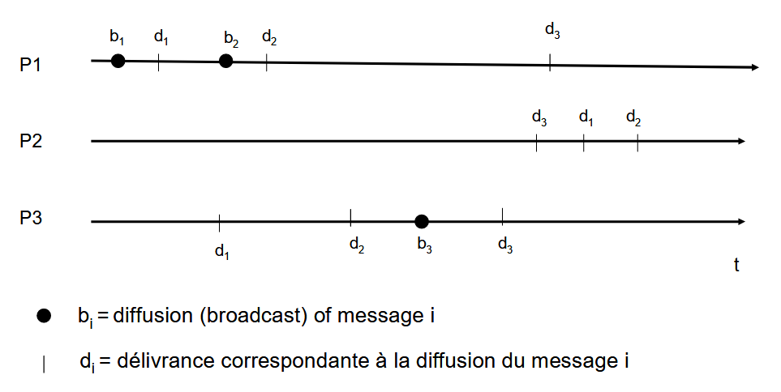
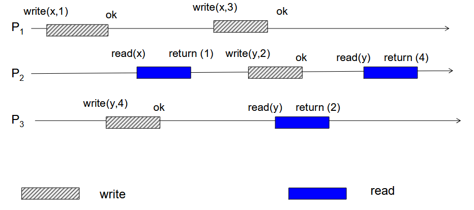

## 2009

### Q1: FIFO? Causal? Total?

- FIFO
    - Oui, `b1, b2` sont delivres dans le meme ordre pour tout les processus
- Causal
    - Non, `b3` depent causalement de `b2`, or `p2` delivre `d3` avant `d2`
- Total
    - Pas total a cause de P2, qui delivre `d3, d1, d2`

### Q2: Coherence sequentielle? Causale? PRAM?

> Algo pour sequentielle:  
> Etablir l'ordre par `processus`
> - p1: `wx1 wx3`
> - p2: `rx1 wy2 ry4`
> - p3: `wy4 ry2`
>
> Etablir l'ordre par `variable`
> - x: `wx1 rx1 wx3`
> - y: `wy2 ry2 wy3 ry3`
>
> FIFO entre l'ordre par `processus` et `variable`  
> Ordre possible donc: `wx1 rx1 wx3 wy2 ry2 wy3 ry3` -> sequence possible

- Sequentielle
    > Une sequence qui marche
    - Pas sequentiel, croisement entre `wy2 ry4` et `wy4 ry2`
    - Il n'existe pas d'ordre possible

- Causale
    > - Happened before + causality inter-processus
    > - Only writes that are causally related must be seen by all processes in the same order. Concurrent writes must be seen in a different order.
    - Les deux writes sur `x` sont sur le meme processus (`p1`)
    - `y` modifie par `p2, p3`, delivrance peut etre considere concurrente
    - > Hint: Quand les deux variables sont clairement separes (pas de `wx->wy->wx`), check pour causal, c'est fort possible!

- PRAM
    > On voit que les writes d'un processeur dans le meme ordre
    - Si causale alors PRAM aussi

### Q3: 