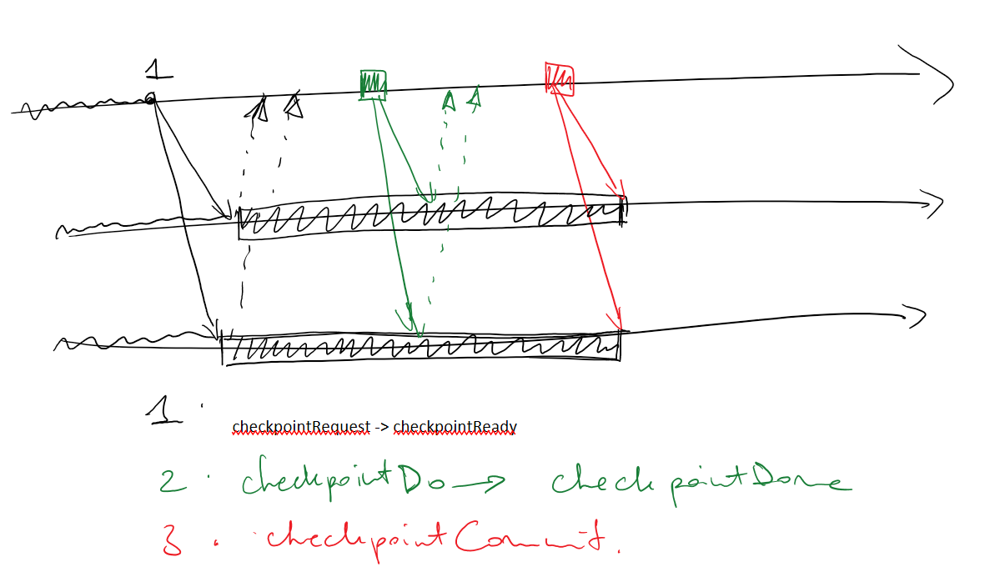

# Vector Clock

- On commence par initialise les scalar de chaque site a 0
- Emission, on increment notre scalar et on envoi le vector avec le message
- Reception, pour chaque site on prend le max entre vector local et vecteur recu

Coupure coherente ssi `Date_X = (V_c0[0], V_c1[1], ..., V_cn[n])`

# Checkpointing Implicite

## SAS - Stop and Sync

Le vrai checkpoint il se fait en phase 2