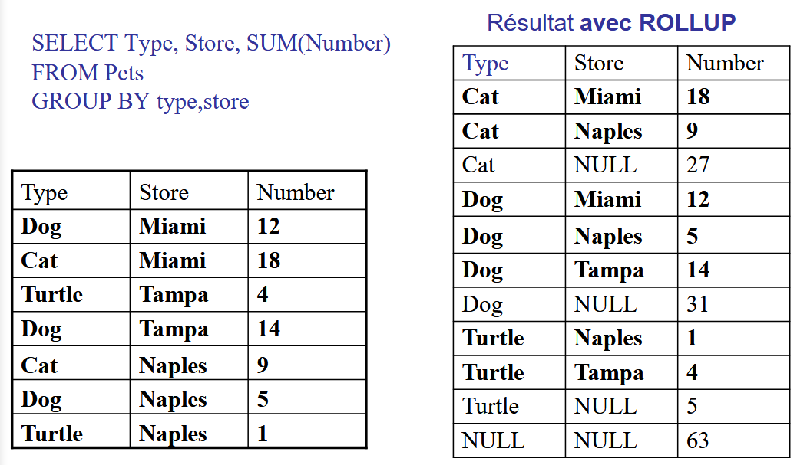
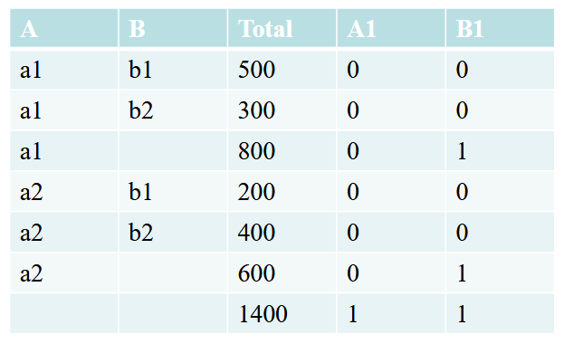

## Aggregation SQL

### `Group by`

Grouping `n` dimentions

```sql
Group By d1, d2, ..., dn
```

Un groupe contient tous les faits qui ont les memes valeurs pour `(d1, ..., dn)`. Les groupes sont disjoints.  
Cause `SELECT` fonction d'agregation:

- `sum`
- `avg`
- `count`
- `min`
- `max`

Resultat: un n-uplet par groupe

Example:

```sql
Sales(StoreID, ItemID, CustID, Qty, Price)

select StoreID, ItemID, CustID, SUM(PRICE)
from Sales
Group by StoreID, ItemID, CustID
```

### `rollup` and `cube`

`ROLLUP (YEAR, MONTH, DAY)`

With a `ROLLUP`, it will have the following outputs:

```sql
YEAR, MONTH, DAY
YEAR, MONTH
YEAR
()
```

With `CUBE`, it will have the following:

```sql
YEAR, MONTH, DAY
YEAR, MONTH
YEAR, DAY
YEAR
MONTH, DAY
MONTH
DAY
()
```

`CUBE` essentially contains every possible `rollup` scenario for each node whereas `ROLLUP` will keep the hierarchy intact (__so it won't skip MONTH and show YEAR/DAY, whereas `CUBE` will__)

### `Rollup`

#### Definition

Syntax: `group b [D] rollup (D').  
`D` et `D'` sont des listes de dimensions `d1...dn`

Aggregation sur `n+1` niveau de regroupements:

- `N1` : group by `d1 .. d(n-1) dn`
- `N2` : group by `d1 .. d(n-1)`
- ...
- `Nn` : group by `d1`
- `Nn+1` : un seul groupe = la table des faits toute entiere

##### `Rollup` partiel

Moins de niveaux

```sql
group by D rollup(D')`
```

Ex: `group by e1 rollup (e2, e3)`, cree les sous-totaux `(e1, e2, e3), (e1, e2), (e1)`

Le `rollup` est utile lorsque les Di sont les niveaux d'une meme hierarchie `rollup(day, month, year)`.

#### Example1

```sql
Select StoreID, ItemID, CustID, sum(Price)
from Sales 
group by rollup(StoreId, ItemID, CustID)
```

outputs:

```text
[s1, i3, c1, 2] [s1, i1, c3, 1] ...
[s1, i1, null, 100] [s1, i2, null, 250] ... // Total par magasin par article
[s1, null, null, 4000] ... // Total par magasin
[nul, null, null, 1000000] // Total general
```

#### Example2

```sql
select regionID, storeID, clerkID, AVG(hourlyPay)
from Sales
group by regionID, rollup(storeID, clerkID)
```

Calcule les agregations au niveau `RegionID`, au niveau `regionID, storeID` et au niveau `RegionID, StoreID, ClerkID`. Pas de total sur l'ensemble.

#### Example3



### `Cube`

#### Definition

Syntax: `group by [D] cube(D')`  
`D` et `D'` sont des listes de dimensions `d1 ... dn`  
Agregation sur tous les niveaux de regroupements par face, arrete, sommet du cube __`(2^n groupes)`__

### `Grouping`

Grouping est une fonction qui renvoie `1` s'il y a un `NULL` cree par `rollup` ou `cube`, `0` sinon.

#### Example1

```sql
EX:  R(A, B, C, D) 
SELECT A, B, SUM(D) as Total, GROUPING(A) as A1, GROUPING(B) as B1
FROM   R
WHERE ...
GROUP BY ROLLUP(A, B)
```



### `Grouping sets`

Permet de definir l'ensemble de groupes sur lesquels on veut calculer des agregations. Evide de calculer tout le cube. Se definit dans la clause `group by`, est l'union de plusieurs `group by`.

```sql
SELECT A, B, C, SUM(D) 
FROM  R
WHERE...
GROUP BY GROUPING SETS ((A,B), (A,C), ()) 

/* Calcule les sous-totaux pour les groupes (A,B), (A,C), et le total global */

CUBE(a,b,c) est équivalent à
GROUPING SETS ((a,b,c), (a,b), (a,c), (b,c), (a), (b), (c) , () )

/* 
Equivalences 
*/

GROUP BY GROUPING SETS (a, b, c) est équivalent à
GROUP BY a UNION ALL
GROUP BY b UNION ALL
GROUP BY c
GROUP BY GROUPING SETS (a, ROLLUP(b,c))

/* est équivalent à */

GROUP BY a UNION ALL
GROUP BY ROLLUP (b, c
```

## Fonctions de classement

- `rank()` classement par position
- `dense-rank()` classement par valeur

Syntax: 
```sql
rank() over (order by ...)
```

`Order by` indique la mesure sur laquelle faire le classement

Classement sur des groupes:
```sql
rank() over (partition by X order by Y)
```
Le classement de `Y` s'effecture sur chaque partition de `X`

## Joins

### Definitions

- `inner join` : pour qu'un n-uplet soit dans le resultat, il faut que la valeur de l'attribut de jointure apparaisse dans les deux tables
- `outer join` : tous les n-uplets apparaissent dans le resultat, avec une valeur `null` pour les attributs lorsque les 2 valeurs ne joignent pas
- `right outer join` : tous les n-uplets de la table de droite apparaissent dans le resultat
- `left outer join` : tous les n-uplets de la table de gauche apparaissent dans le resultat

### Examples

#### Generation d'un n-uplet pour les produits n'ayant pas ete vendus certains mois, en mettant la valeur 0 pour les ventes dans ce cas

```sql
Select v2.month, v1.product-name, nvl(v1.sales, 0)
FROM 
    (SELECT t.month, p.product-name, SUM(f.purchase-price) as sales
    FROM PURCHASE f, TIME t, PRODUCT p
    WHERE f.time-key = t.time-key
        AND f.product-id = p.product-id
    GROUP BY p.Product-name, t.month)
    v1 PARTITION BY (product-name)
RIGHT OUTER JOIN
    (SELECT distinct t.month
    FROM TIME t) v2
    ON v1.month = v2.month)
```

- `v1` : vente des produits par mois
- `v2` valeurs distinctes des mois
- `partition by (product-name)` : prend le resultat de `v1` et partitionne par nom de produit
- `right outer join` : fait la jointure externe en prenant toutes les valeurs des mois `(RIGHT)`
- `nv1(v1.sales, 0)` : insere la valeur `0` (au lieu de `NULL`) pour les n-uplets n'ayant pas de valeur de jointure avec la table de gauche