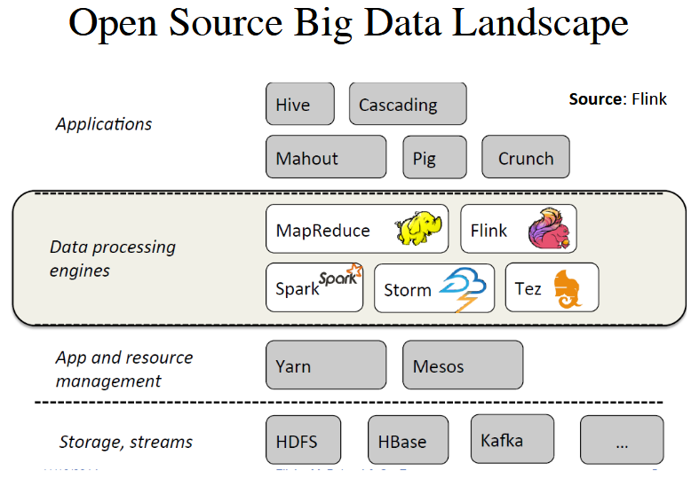

## Landscape



Platforms of Map Reduce:

- Distributed treatment
    - Hadoop MapReduce (Google, 2004)
        - Redundant Array of Inexpensive Nodes (RAIN) architecture
        - Written in Java
    - Flink (Stratoshpere, TU Berlin, 2009)
    - Spark (MPLab, Stanford, 2012)
        - Solve MapReduce limits
        - Resilient Distributed Dataset (RDD)
- Storage 
    - HadoopFS
    - HBase
    - Kafka
- Scheduler
    - Yarn
    - Mesos
- High level
    - Pig
    - Hive
    - Spark SQL

## Rudiments

- `val` vs `var`
    - `val`s are immutable
    - `var`s are mutable
    - Snippet
        ```scala
            val n = 1+10
            n=n+1
            <console>:12: error: reassignment to val
            n=n+1 
                ^ 
        ```
- Function definition
    - Returns are automatic, except recursive functions.
    ```scala
    def max(x: Int, y: Int): Int =
        if (x>y)
            x
        else
            y
    ```
    - Fonctions d'ordre superieur
        - Correspondance: `map, flatMap, foreach`
            - `flatMap`
                - Equivalent a `l.map(f).flatten`
                ```scala
                > def succ(n: Int) = n+1

                > nestd_1a5
                res: List[List[Int]] = List(List(1,2,3), List(4, 5))

                > val deuxA6 = nestd_1a5.flatMap(succ)
                deuxA6: List[Int] = List(2, 3, 4, 5, 6)
                ```
            - `foreach(f)`
            ```scala
            > 4a5.foreach(println)
            4
            5
            ```
        - Filtres: `filter, partition, find`
            - `l.filter(cond): Bool`
            - `l.partition(cond) <=> (l.filter(cond), l.filter(!cond))`
            - `l.find(conf)`
            ```scala
            > 2a6.filter(x=>x%2 == 0)
            List[Int] = List(2, 4, 6)

            > 2a6.partition(x=> x%2 ==0)
            (List[Int], List[Int]) = (List(2, 4, 6), List(3, 5))

            > 2a6.find( x=> x%2 == 0)
            Option[Int] = Some(2)

            > 2a6.find( x=> x%7 == 0)
            Option[Int] = None
            ```
        - Predicats: `exists, forall`
        - Reduction: `fold, reduce`
            - `l.fold(zero)(g: (T, T) => T)`
                - Applique `op` sur toute paire `(x, y)` de `l`, la premiere paire etant `(zero, l(0))`
            - `l.foldRight(zero)(g: (T,T) => T)`
                - Applique `g` en commencant par la droite
            - `l.reduce(g: (T,T) => T)` 
                - Applique `g` sur les elements de `l`
            ```scala
            > def g(a: Int, b:Int) = {
                println(a + "\t" + b)
                a+b
            }

            > val l = List(5, 2, 6, 9)

            > l.fold(0)((a,b)=>g(a,b))
            0   6
            6   2
            8   6
            14  9
            res: Int = 23

            > l.foldRight(0)((a, b) => g(a, b))
            9   0
            6   9
            2   15
            6   17
            res: Int = 23

            > l.reduce((a, b) => g(a, b))
            6   2
            8   6
            14  9
            res: Int = 23
            ```

- Control structures
    - `if`
        - Snippet:
            ```scala
            val chaine = "abcde"
            val len = if (chaine.length %2==0)
                    "pair"
                else
                    "impair"
            ```
    - `while`
        - A eviter, car style imperatif
    - `for`
        - Permet d'iterer sur des collections sans se soucier de l'index
        - `for` clauses `yield` body
        - imbrication de plusieurs `for` possible
        - Example
            ```scala
            val wdays = List("Mon", "Tue", "Wed", "Thu", "Fri")
            for (d <- wdays) print(d + "\t")
            > Mon Tue Wed Thu Fri
            for (d <- wdays) yield(d + "\t")
            > List[String]=List("Mon", "Tue", "Wed", "Thu", "Fri")
            for {d <- wdays; md <- 1 to 4} yield d+md
            > List[String] = List(Mon1, Mon2, Mon3, Mon4, Tue1,...)
            ```
    - `match`
        - Branchement conditionnel a `n` alternatives (`switch` en Java)
        - A la base du `pattern matching`
        - Snippet:
            ```scala
            var match {
                case val0 => res0
                case val1 => res1
                ...
                case _ => res_default
            }
            ```
    - `functions`
        - Comme `litteraux` ou `variables`
            ```scala
            > (x: Int) => x+1
            res8: Int => Int = $Lambda$1296/1094867051@4966454a

            > var inc = (x: Int) => x+1
            inc: Int => Int = $Lambda$1285/2112826959@7da4486

            > inc(10)
            res9: Int = 11

            > inc = (x: Int) => x+100
            inc: Int => Int = $Lambda$1294/1404292507@4a218cc6

            ```
- Types complexes
    - `Array`
        - Construction en utilisant le nom de la classe
        - Acces indexe pour lecture ou ecriture, 1er element = 0
            ```scala
            > val weekend = Array("sam", "dim")
            weekend: Array[String] = Array(sam, dim)

            > weekend.update(0, "ven")

            > weekend.update(1, "sam")

            > weekend
            res: Array[String] = Array(ven, sam)

            > weekend(0)
            res: String = ven

            > weekend(1)
            res: String = sam

            > weekend(0) = "jeu"
            ```
    - `List`
        - Construction suivant differentes manieres
            - Conversion d'un `Array`
            - Instanciation d'un objet `List` avec valeurs fournies
            - Recursivement avec `cons` concatenation
        ```scala
        > val lweekend = weekend.toList
        lweekend: List[String] = List(ven, sam)

        > val fruits = List("pomme", "orange", "poire")
        fruits: List[String] = List(pomme, orange, poire)

        > val unAtrois = 1 :: 2 :: 3 :: Nil
        unAtrois: List[Int] = List(1, 2, 3)
        
        // Lists comprehension

        // Add head element (immutable)
        > 4 :: unAtrois
        res: List[Int] = List(4, 1, 2, 3)

        val quatreAun = 4 :: unAtrois.reverse
        quatreAun: List[Int] = List(4, 3, 2, 1)

        // Concat with :: - internal order preserved
        > val quatreAcinq = 4 :: 5 :: Nil
        quatreAcinq: List[Int] = List(4, 5)

        > val unAcinq = unAtrois :: quatreAcinq
        unAcinq: List[Int] = List(1, 2, 3, 4, 5)
        ```
        - Pattern Matching
        ```scala
        def affiche(fruits: List[String]): String = {
            fruits match {
                case List() => "."
                case elem :: suite => elem + "," + affiche(suite)
            }
        }

        affiche: (fruits: List[String]): String

        > affiche(fruits)
        res: String = pomme, orange, poire, .
        ```
        - `flatten`

        ```scala
        > val nested_1a5 = List(1a3, 4a5)
        nested_1a5: List[List[Int]] = List(List(1,2,3), List(4,5))

        > nested_1a5.flatten
        res: List[Int] = List(1, 2, 3, 4, 5)
        ```
    - `Tuple`
        - Acces avec `._index`, `index` commence a 1
        - Immutable
         ```scala
        > val tuple = (12, "text", List(1,2,3))
        tuple: (Int, String, List[Int]) = (12, text, List(1,2,3))

        > tuple._1 = 13 
        error: reassignment to val
        ```
        - Pattern matching
        ```scala
        > val listeTmp = List((7, 2010, 4, 27, 75), (12, 2009, 1, 31, 78))
        listeTmp: List[(Int, Int, Int, Int, Int)]=List((7, 2010, 4, 27, 75), (12, 2009, 1, 31, 78))

        > listeTmp.map{case(sid, year, month, value, zip) => (year, value)}
        res: List[(Int, Int)] = List((2010, 27), (2009, 31))
        ```
    - `Map`
        - Tableaux associatifs
        - Ensemble de paires `(key, value)`
        - Possibilite d'insertion et de mise a jour de nouvelles paires
        ```scala
        > var cap = Map("US" -> "Washington", "France" -> "Paris")

        > capital("US")
        res: String = Washington

        > capital += ("US" -> "DC", "Japan" -> "Tokyo")
        Map(US->DC, France -> Paris, Japan -> Tokyo)
        ```
    - `Classes`
        - Conteneurs pour objets ayant les memes attributs
        ```scala
        class MyClass (nom: String, num: Int) { <additionnal attributes and methods> }

        > class Measure(sid: Int, year: Int, value: Float)
        defined class Measure

        > listeTmp.map{ case(sid, year, month, value, zip) => new Measure(sid, year, value) }
        res: List[Measure] = List(Measure@9038210c09e, Measure@775487aec)
        ```