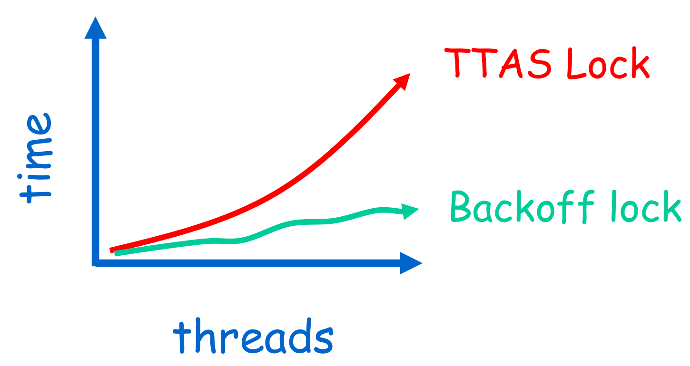
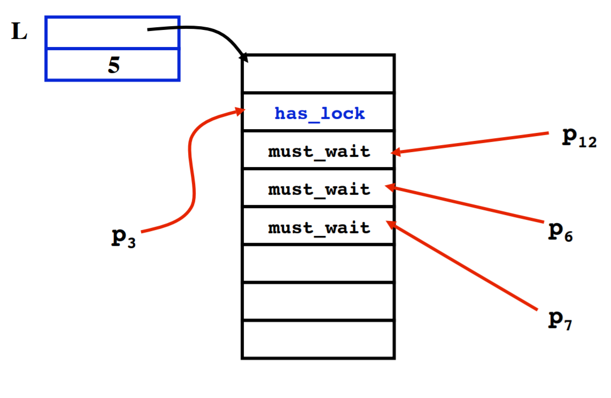
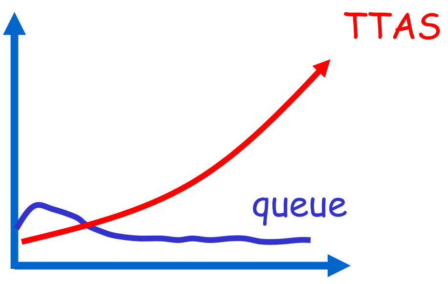
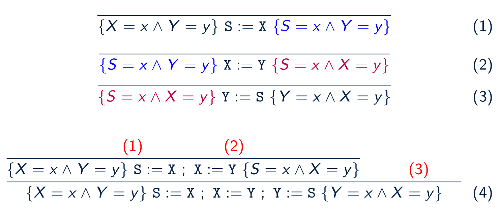

# Concurrency is hard
- [Concurrency is hard](#concurrency-is-hard)
    - [L'accident du Therac-25](#laccident-du-therac-25)
    - [Ariane 501](#ariane-501)
    - [Sequential Stack in a concurrent world](#sequential-stack-in-a-concurrent-world)
    - [Solutions](#solutions)
    - [CAS - Compare and Swap](#cas---compare-and-swap)
        - [What does it do](#what-does-it-do)
        - [Code](#code)
        - [Example](#example)
    - [TAS - Test and Set / Get and Set](#tas---test-and-set-get-and-set)
    - [The ABA problem](#the-aba-problem)
        - [ABA Example](#aba-example)
        - [ELI5](#eli5)
    - [Test and test and set](#test-and-test-and-set)
    - [Exponential Backoff](#exponential-backoff)
    - [Anderson Queue Lock](#anderson-queue-lock)
        - [Idea](#idea)
        - [Anderson ELI5](#anderson-eli5)
    - [Hazard pointers - Michael's algorithm](#hazard-pointers---michaels-algorithm)
        - [Michael's `pop()` and `push()`](#michaels-pop-and-push)
    - [LL/SC - Load Link / Store Conditional](#llsc---load-link-store-conditional)
    - [LL/SC Invariants](#llsc-invariants)
    - [Logique de Hoare](#logique-de-hoare)
    - [The Hoare triple](#the-hoare-triple)
    - [Primitives](#primitives)
        - [Hoare Example](#hoare-example)
    - [Linearisability](#linearisability)
    - [Java](#java)
    - [TM - Transactional Memory - Software TM - Hardware TM](#tm---transactional-memory---software-tm---hardware-tm)
    - [Peterson](#peterson)
    - [Architectures](#architectures)
    - [MIMD - Multiple Instruction Multiple Data](#mimd---multiple-instruction-multiple-data)
        - [Shared bus](#shared-bus)
        
## L'accident du Therac-25

1985-87 Machine therapie a rayonnement

- Tres puissant
- Modulable par logiciel
- Initialement, OK
- Au bout de 6 mois, surdoses x100, mortelles
- Ingenieurs n'arrivent pas a reproduire
- Uniquement lorsque l'operateur tape vite une erreur puis la corrige
- EN meme temps qu'un certain test
- int overflow

## Ariane 501

Plusieurs calculateurs de vol communiquant sur un bus
Un processus de verification de fond plante

- calibre pour Ariate 4 : debordement
- inutile
- core dump sur le bus
  Interprete comme une commande
- tuyeres braquees a fond
- auto-destruction

$500m lost.

## Sequential Stack in a concurrent world

```c
pop ( ) {
    t = Top;
    if (t != nil)
        Top = t->tl;
    return t;
}

push (b) {
    b->tl = Top;
    Top = b;
    return true;
}
```

Imagine that two threads invoke `pop()` concurrently. They might pop the same entry!


## Solutions

## CAS - Compare and Swap

Solution for concurrency is sequential world.
Hardware abstraction, in software, usually within `while(true)`

### What does it do

The `CAS(addr, expected, new)` tests if the `expected` is located at `addr`. If it is, it replaces it with `new` and returns `true`. Otherwise it returns `false` without any action.

### Code

```c
bool CAS(val_t *addr, val_t expected, val_t new_val) {
    atomic {
        if (*addr == exp) then {
            *addr = new;
            return true;
        }
        else return false;
    }
}
```

### Example

Considering the followint `pop()` code:

```c
pop() {
    while (true) {
        t = Top;
        if (t == nil) break;
        n = t->tl;
        if CAS(&Top,t,n) break;
    }
    return t;
}
```

and two processes `p1` and `p2`.
Two concurrent `pop()` now work fine.


`CAS` of th1 (red) fails.

## TAS - Test and Set / Get and Set

Usually called TAS, should be called GAS (_Get And Set_).
Hardware instruction but doesn't test (like CAS).

```java
class AtomicBoolean {
    private boolean b;
    public synchronized boolean getAndSet() {
        boolean tmp = b;
        b = true;
        return tmp;
    }
}

class AtomicReference<T> {
    private T ref;
    public T getAndSet() { }
    public void set(T r) { }
    public boolean synchronized compareAndSet(T expectedRef, T newRef) {
        if (ref == expectedRef) {
            ref = newRef;
            return true;
        } else
            return false;
    }
}
```

This mechanism is used essentially to implement low level locks.

## The ABA problem

The ABA problem occurs during synchronization, when a location is read twice, has the same value for both reads, and "value is the same" is used to indicate "nothing has changed". However, another thread can execute between the two reads and change the value, do other work, then change the value back, thus fooling the first thread into thinking "nothing has changed" even though the second thread did work that violates that assumption.
Free, allocate another thing at the same @, CAS passes through, invariant violated.

### ABA Example

Process `p1` reads value `A` from shared memory,

- `p1` is preempted, allowing process `p2` to run,
- `p2` modifies the shared memory value A to value B and back to A before preemption,
- `p1` begins execution again, sees that the shared memory value has not changed and continues.

Although `p1` can continue executing, it is possible that the behavior will not be correct due to the "hidden" modification in shared memory.

### ELI5

John is waiting in his car at a red traffic light with his children. His children start fighting with each other while waiting, and he leans back to scold them. Once their fighting stops, John checks the light again and notices that it's still red. However, while he was focusing on his children, the light had changed to green, and then back again. John doesn't think the light ever changed, but the people waiting behind him are very mad and honking their horns now.

## Test and test and set

Wait until lock looks free by spinning on local cache. No bus use while lock busy.
Problem? When lock is released - invalidation storm.

## Exponential Backoff

Easy to implement, same thing as in a CSMA/CA. On spinlock, back off, wait for exponentially inreasing period of time (usually bounded).
[+] Easy to implement
[+] Better performance than TTAS
[-] 'Pifologique' fine-tuning
[-] Not portable across architectures/platforms



## Anderson Queue Lock

### Idea

Avoids useless invalidations by keeping a queue of threads. Each thread notifies next in line withought bothering the others. Fairness is ensured by using FIFO queue mechanism.

- [+] First truly scalable lock
- [+] Simple, easy to implement
- [-] Space hog
- [-] One bit per thread
- Unknown number of threads
- Small number of actual contenders?

### Anderson ELI5

Relay race where the athlete passes on the baton to the next athlete in queue which ensures that the only one athlete acquires the baton.



- Shorter handover than backoff
- Curve is practically flat
- Scalable performance
- FIFO fairness



## Hazard pointers - Michael's algorithm

Michael adds to the previous algorithm a _global array_ `H` of _hazard pointers_:

- thread `i` alone is allowed to write to element `H[i]` of the array;
- any thread can read any entry of `H`.

The algorithm is then modified:

- before popping a cell, a thread puts its address into its own element of `H`. This entry is cleared only if `CAS` succeeds or the stack is empty;
- before pushing a cell, a thread checks to see whether it is pointed to from any element of `H`. If it is, push is delayed. Exponential backoff.

So,

- A node can be added to the hazard array only if it is reachable through the stack;
- a node that has been popped is not reachable through the stack;
- a node that is unreachable in the stack and that is in the hazard array cannot be added to the stack;
- while a node is reachable and in the hazard array, it has a constant tail.

### Michael's `pop()` and `push()`

```c
pop ( ) {
    while (true) {
        atomic { t = Top;
        H[tid] = t; };
        if (t == nil) break;
            n = t->tl;
        if CAS(&Top,t,n) break;
    }
    H[tid] = nil;
    return t;
}

push (b) {
    for (n = 0; n < no_threads, n++)
        if (H[n] == b) return false;
    while (true) {
        t = Top;
        b->tl = t;
        if CAS(&Top,t,b) break;
    }
    return true;
}

```

## LL/SC - Load Link / Store Conditional

Similar to CAS but very hard to implement
Supervise addresses, if they change, notify.

`Load-Link(x)` supervises `x` address
`Store-Conditional (x, y)`

- `x := y` return true, only if `x` was not modified since `Load-Link(x)`

## LL/SC Invariants

## Logique de Hoare

Logique qui permet de raisonner sur les programmes sequentielles.

## The Hoare triple

`[p] C [q]`

- p : pre-condition
- C : Calcul
- q : post-contition

## Primitives

- Sequence : `a ; b`
  Two conditions: `{P} C1 {Q}` and `{Q} C2 {R}` sequence to `{P} C1; C2 {R}`
  Example `(Swap X Y)`:
  

- Skip (do nothing)
`{P} SKIP {P}`

- Variable assignment: `X:=0`

- Conditional: `IF cond THEN a ELSE b FI`

- Loop: `WHILE cond DO c OD`

  `{P ^ S} C {P}` -> `{P} WHILE _S_ DO _C_ {P ^ !S}`

  - P is an _invariant_ for _C_ whenever _S_ holds
  - _WHILE_ rule: If executing _C_ once preserves the truth of P, then executing _C_ any number of times also preserver the truth of _P_
  - If _P_ is an invarant for _C_ when _S_ holds then _P_ is an invariant of the __whole__ `WHILE` loop, i.e. a _loop invariant_
  - Finding the invariant:

### Hoare Example

`{X=1} X:= X+1 {X=2}`

## Linearisability

Point de linearisation -> fin d'execution

```bash
                       q.enq(x)
------------------|--------------|------------------------
                                 ^ here
```

## Java

`volatile` means that access to this var are gonna be serializable

## TM - Transactional Memory - Software TM - Hardware TM

Permet atomicite sur tout.

Le Hard/Software checks allow atomicity for all.

## Peterson

The smallest possible synchro algo for two threads (verified with a model checked).
The number of registers needed to implement it is exponential to the number of threads to synchronize.

## Architectures

## MIMD - Multiple Instruction Multiple Data

MIMD instructions are used in large scale systems; this means that at any time, multiple processors may be working on multiple data sets. This is in contrast with SIMD instructions, where a single instruction is operating on multiple datasets: the processor may be using its ALU(s) and FPU(s) etc. at the same time but there is no inherent concurrency in execution, since there is only one instruction to execute from the CPU's point of view.

MIMD processors usually make use of a shared bus to access the central memory shared between the CPUs.

### Shared bus

- Memory Contention: different processes want to access a single memory location at the same time, creating contention.
- Communication Contention: different processes want to access the shared bus at the same time, someone has to give permission for a process at a time to do it. Processes will therefore be usually waiting an arbitrary amount of time before accessing the bus.
- Communication Latency: muh contention brings latency.
