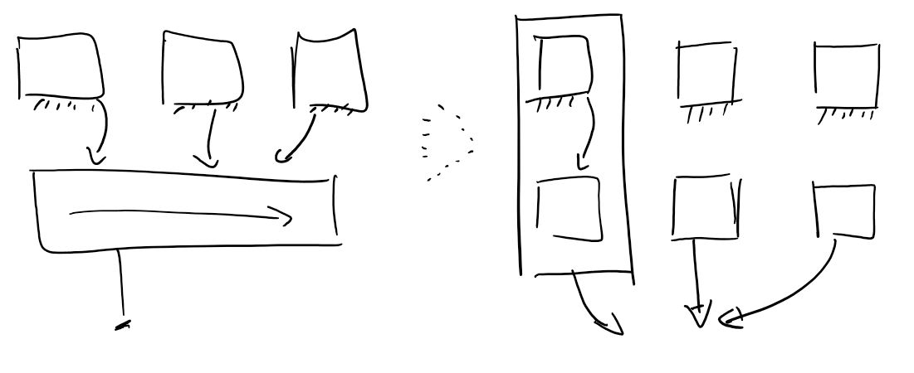

# Programme 2eme partie semestre

- 2 seances ordonnancement multicoeur
- 3 seances sur la memoire
    - Comment fonctionne la gestion de la memoire
    - Comment fonctionne la table de pages
    - Qu'est ce que c'est de faire un hyperviseur
    - Coherence de la memoire
    - Associativite de lignes de caches etc
- Containers

Pour l'evaluation:

- Pas de code complique
- Pas de documents
- Ensemble de plein de questions de cours
- "Est-ce que vous avez au moins retenu ce qui peut servir a tout le monde"

# Techniques de synchronisation

Deux problemes (On a les memes problemes dans mono et multicoeur mais on utilise pas les memes solutions):
- Context switch
- Interruptions
- Deux personnes qui partagent mutuellement le CPU (?)


## Solutions monocoeur
---

1. Stop les Interruptions

```c
local_irq_{disable, enable}()
```

2. Desactiver la preemption (Context switch)

```c
preempt_{disable, enable}()
```

Linux preemptif a partir de 2.6

## Solutions de synchro multicoeur
___

### Spinlock (je bloque tout)
---

#### Inconvénients
- Locks à attente active.
- On teste une même case mémoire tout le temps => contention memoire
- Sur les caches avec protocole MOESI - lourd aussi pour les reads que les writes
car toute lecture diffuse des requêtes sur le bus (état S == Shared de MOESI)
    - > To reduce inter-CPU bus traffic, code trying to acquire a lock should loop reading without trying to write anything until it reads a changed value. Because of MESI caching protocols, this causes the cache line for the lock to become "Shared"; then there is remarkably no bus traffic while a CPU waits for the lock. This optimization is effective on all CPU architectures that have a cache per CPU, because MESI is so widespread.
        >
        > _[Wiki](https://en.wikipedia.org/wiki/Spinlock#Significant_optimizations) `(https://en.wikipedia.org/wiki/Spinlock#Significant_optimizations)`_
- Dans le noyau ils ne sont pas recursifs
- Comme les spinlocks utilisent le CPU à fond, on peut avoir des problèmes au niveau de la consommation énergétique

#### L'avantage

- Les spinlocks sont surtout utilisés dans les handlers d'interruptions (meilleures perf avec peu de concurrence/peu de contention)
- On ne peut faire de mutex/barriere/etc dans un handler d'irq car pas moyen de s'endormir sur une ressource

#### Alternatives

>The primary disadvantage of a spinlock is that, while waiting to acquire a lock, it wastes time that might be productively spent elsewhere. There are two ways to avoid this:
>
>- Do not acquire the lock. In many situations it is possible to design data structures that do not require locking, e.g. by using per-thread or per-CPU data and disabling interrupts.
>-  Switch to a different thread while waiting. This typically involves attaching the current thread to a queue of threads waiting for the lock, followed by switching to another thread that is ready to do some useful work. This scheme also has the advantage that it guarantees that resource starvation does not occur as long as all threads eventually relinquish locks they acquire and scheduling decisions can be made about which thread should progress first. Spinlocks that never entail switching, usable by real-time operating system, are sometimes called raw spinlocks.
>
>Most operating systems (including Solaris, Mac OS X and FreeBSD) use a hybrid approach called "adaptive mutex". The idea is to use a spinlock when trying to access a resource locked by a currently-running thread, but to sleep if the thread is not currently running. (The latter is always the case on single-processor systems.)
>
>OpenBSD attempted to replace spinlocks with ticket locks which enforced first-in-first-out behaviour, however this resulted in more CPU usage in the kernel and larger applications, such as Firefox, becoming much slower.
>
> _[Wiki]((https://en.wikipedia.org/wiki/Spinlock#Alternatives)) `(https://en.wikipedia.org/wiki/Spinlock#Alternatives)`_

#### API

>Note that these methods are implemented at least in part as macros, so the flags parameter (which must be defined as an `unsigned long`) is seemingly passed by value. This parameter contains architecture-specific data containing the state of the interrupt systems. Because at least one supported architecture incorporates stack information into the value (ahem, SPARC), flags cannot be passed to another function (specifically, it must remain on the same stack frame). For this reason, the call to save and the call to restore interrupts must occur in the same function.
>
> _Robert Love, Linux Kernel Development_

```c
DEFINE_SPINLOCK(my_slock)
unsigned long flags;
spin_lock_irqsave(&my_spin, flags);
spin_unlock_irqsave(&my_spin, flags);
```
__Attention!__

`spin_lock_irqsave` is basically used to save the interrupt state before taking the spin lock, this is because spin lock disables the interrupt, when the lock is taken in interrupt context, and re-enables it when while unlocking. The interrupt state is saved so that it should reinstate the interrupts again.

Example:

- Lets say interrupt `x` was disabled before spin lock was acquired
- `spin_lock_irq` will disable the interrupt `x` and take the the lock
- `spin_unlock_irq` will enable the interrupt `x`, leading to incoherent state

So in the 3rd step above after releasing the lock we will have interrupt `x` enabled which was earlier disabled before the lock was acquired.

So only when you are sure that interrupts are _not disabled_ only then you should `spin_lock_irq` otherwise you should _always_ use `spin_lock_irqsave`.


### Recopier les variables par coeur (je me ramene en monocoeur)
---

Le principe est de faire une copie d'une variable localement sur chaque CPU pour éviter des accès en partage (voir [fig1](#fig1)).
Un point de linéarisation/cohérence possible dans le noyau est la lecture de la valeur dans `sysfs`. À ce moment-là, la valeur normale est "ré-assemblée" depuis les variables `_per_cpu`. Genre une somme par exemple.


Dans le noyau y a plein de variables marques `PER_CPU` pour ces raisons de perf et de simplification d'accès mémoire/cache.

#### API

```c
/**
S'arrange pour que les viariables soient sur des lignes de caches differentes.
Sinon niveau perf ca peut ne rien apporter, si on fait int i1, i2, i3, i4; 
ca peut etre alloue sur la meme ligne -> nothing changed.
**/
DEFINE_PER_CPU(type, name)
DEFINE_PER_CPU(int, i)

// To recover
per_cpu(nomVar, cpu);
// Dans multicoeur on peut avoir preemption et commutation <- ultra mega cher
__get_cpu_var;
// Donc y a la fonction disable la preemption
get_cpu_var(var)
```

#### Le probleme possible:

On fait `__get_cpu_var`, en tant que cpu1, on se fait preempte au millieu d'appel systeme et migre sur cpu2, ou on fait `__put_cpu_var` et on ecrit (on ecrit pas chez nous)


 

### Operations Atomiques (on se repose sur les instructions matérielles)
---

Type: `atomic_t`  
Operations: `atomic{_inc, _add, _dec_and_Test, tons more}`

### Mutex
---
Equivalent à sémaphore initialisé à 1
#### Avantage
Classique. On connait!

#### Inconvénient
On dort donc y a plein d'endroits dans le noyau ou on peut pas l'utiliser

#### API:

```c
mutex_init(&my_mut);
mutex_lock(&my_mut);
mutex_unlock(&my_mut);
```


### Sémaphore
---

Deux questions à se poser sur les sémaphores:
- Est-il interruptible?
- Dijkstra ou generaliste?

Un sémaphore revient à un mutex généralise avec un compteur, deux types
- Semaphore de Dijkstra : Compteur est positif ou nul
- Semaphore generalise : Compteur peut être negatif

#### API:

```c
sem_init(&my_sem);
if (sem_down(&my_sem)) {
    stuff;
}
sem_up(&my_sem);
```

### Semaphore vs Mutex
---

>A mutex is essentially the same thing as a binary semaphore and sometimes uses the same basic implementation. The differences between them are in how they are used. While a binary semaphore may be used as a mutex, a mutex is a more specific use-case, in that only the thread that locked the mutex is supposed to unlock it. This constraint makes it possible to implement some additional features in mutexes:
>
>- Since only the thread that locked the mutex is supposed to unlock it, a mutex may store the id of thread that locked it and verify the same thread unlocks it.
>- Mutexes may provide priority inversion safety. If the mutex knows who locked it and is supposed to unlock it, it is possible to promote the priority of that thread whenever a higher-priority task starts waiting on the mutex.
>- Mutexes may also provide deletion safety, where the thread holding the mutex cannot be accidentally deleted.
>- Alternately, if the thread holding the mutex is deleted (perhaps due to an unrecoverable error), the mutex can be automatically released.
>- A mutex may be recursive: a thread is allowed to lock it multiple times without causing a deadlock.
>
> _[Wiki](https://en.wikipedia.org/wiki/Semaphore_(programming)#Semaphores_vs._mutexes) `(https://en.wikipedia.org/wiki/Semaphore_(programming)#Semaphores_vs._mutexes)`_

### Completion Variables
---
Variables indiquant la terminaison/completion d'un job. Sorte de barrière mémoire.  
[Ressources gnu.org](https://www.gnu.org/software/emacs/manual/html_node/elisp/Completion-Variables.html)

#### Why they exist

>The basic summary is that we had this (fairly common) way of waiting for certain events by having a locked semaphore on the stack of the waiter, and then having the waiter do a "down()" which caused it to block until the thing it was waiting for did an "up()".
>
>This works fairly well, but it has a really small (and quite unlikely) race on [Symmetric Multiprocessing (SMP)](https://en.wikipedia.org/wiki/Symmetric_multiprocessing), that is not so much a race of the idea itself, as of the implementation of the semaphores. We could have fixed the semaphores, but there were a few reasons not to:
>
>- the semaphores are optimized (on purpose) for the non-contention case. The "wait for completion" usage has the opposite default case
>- the semaphores are quite involved and architecture-specific, exactly due to this optimization. Trying to change them is painful as hell.
>
>So instead, I introduced the notion of "wait for completion":
>
>```c
>struct completion event;
>
>init_completion(&event);
>.. pass of event pointer to waker ..
>wait_for_completion(&event);
>```
>
>where the thing we're waiting for just does "complete(event)" and we're all done.
>
>This has the advantage of being a bit more obvious just from a syntactic angle about what is going on. It also ends up being slightly more efficient than semaphores because we can handle the right expected case, and it also avoids the implementation issue that made for the race in the first place.
>
> Switching over to the new format is really trivial:
>
>```c
>struct semaphore -> struct completion
>init_MUTEX_LOCKED -> init_completion
>DECLARE_MUTEX_LOCKED -> DECLARE_COMPLETION
>down() -> wait_for_completion()
>up() -> complete()
>```
>
>and you can in fact maintain 2.2.x compatibility by just having a 2.2.x compatibility file that does the reverse mappings.
>
> In case anybody cares, the race was that Linux semaphores only protect the accesses _inside_ the semaphore, while the accesses by the semaphores themselves can "race" in the internal implementation. That helps make an efficient implementation, but it means that the race was:
>
>```
>cpu #1                          cpu #2
>
>DECLARE_MUTEX_LOCKED(sem);
>..
>down(&sem); up(&sem);
>return;
>                                wake_up(&sem.wait) /*BOOM*/
>```
>
>where the waker still touches the semaphore data structure after the sleeper has become happy with it no longer being locked - and free'd the data structure by virtue of freeing the stack. 
>
> _[Linus Torvalds, LKML](http://lkml.iu.edu/hypermail/linux/kernel/0107.3/0674.html) `(http://lkml.iu.edu/hypermail/linux/kernel/0107.3/0674.html)`_


#### Avantages

> There are two reasons you might want to use a completion instead of a semaphore. First, multiple threads can wait for a completion, and they can all be released with one call to `complete_all()`. It's more complex to have a semaphore wake up an unknown number of threads.
>
> Second, if the waiting thread is going to deallocate the synchronization object, there is a race condition if you're using semaphores. That is, the waiter might get woken up and deallocate the object before the waking thread is done with `up()`. This race doesn't exist for completions.
>
> _[StackOverflow](https://stackoverflow.com/a/4765577) `(https://stackoverflow.com/a/4765577)`_

- 1 `V()` pour multiple `P()`
- `P()` si personne -> `/dev/null`

API:

```c
init_completion(&my_comp);
wait_for_completion(&my_comp);
complete(&my_comp);
```

### Lecteur/Ecrivain
---

Interruptible!
-

API:

```c
down_read(&my_rw);
up_read(&my_rw);

down_write(&my_rw);
up_write(&my_rw);
```

### Read-Copy-Update (RCU)
---

Soit on lit une copie de la donnée, soit la donnée mise à jour. On n'a pas forcément besoin de la dernière valeur == on chope une valeur ayant été cohérente/valide à un moment donné dans le passé (proche)

Quand on veut faire un read, en vrai on démarre un lecteur RCU
rcu_read_unlock()

Quand on écrit, on balance un synchronize_rcu()
Ceci fait la barrière de cohérence

Les RCU assurent qu'avant une écriture sur une variable "partagée", on est cohérent, et après aussi. Les lectures PENDANT l'écritures vont finir par se compléter, et on s'assure toujours que l'écriture finit APRÈS toute lecture déjà qui s'éxecute

Impl. Chaque CPU a un état quiescent/pas quiescent

The name comes from the way that RCU is used to update a linked structure in place. A thread wishing to do this uses the following steps:

- create a new structure,
- copy the data from the old structure into the new one, and save a pointer to the old structure,
- modify the new, copied, structure update the global pointer to refer to the new structure, and then
 - sleep until the operating system kernel determines that there are no readers left using the old structure, for example, in the Linux kernel, by using synchronize_rcu().

When the thread which made the copy is awakened by the kernel, it can safely deallocate the old structure.

So the structure is read concurrently with a thread copying in order to do an update, hence the name "read-copy update". The abbreviation "RCU" was one of many contributions by the Linux community. Other names for similar techniques include passive serialization and MP defer by VM/XA programmers and generations by K42 and Tornado programmers.

___
#### fig1

___