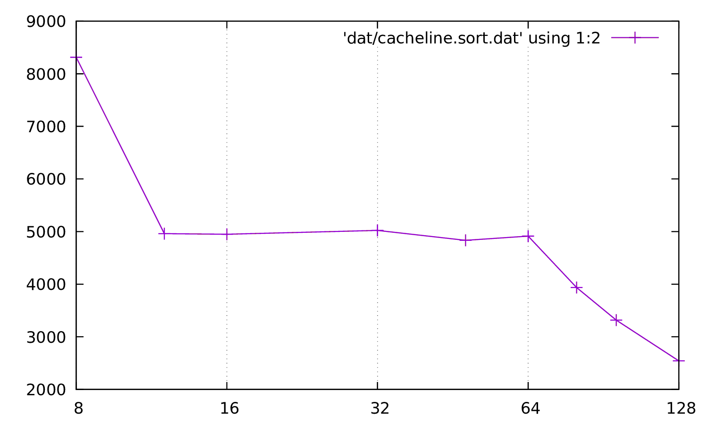

# Exo1

> Dans cet exercice, on veut mesurer la taille d’une ligne de cache. On rappelle que si un accès mémoire est fait par le processeur sur une donnée déjà en cache, un cache hit se produit et la donnée est servie rapidement depuis le cache. À l’inverse, si la donnée n’est pas en cache, un cache miss se produit et la donnée est servie lentement depuis la mémoire.
>
>On propose d’utiliser le code suivant pour déterminer la taille d’une ligne de cache.
>
>```c
> char *mem = allocate_and_touch_memory(MEMORY_SIZE);
> start_timer();
> for (i = 0; i < MEMORY_SIZE; i += PARAM)
> mem[i] = 1;
> stop_timer();
> ```
> La fonction `void *allocate and touch memory(size t size)` alloue en mémoire le nombre d’octet indiqué et initialise la nouvelle zone à zéro. De plus, les fonctions `void start timer(void)` et `void stop timer(void)` servent à mesurer le temps d’exécution de la boucle.

## Question 1
> En vous rappellant du cours de la semaine précédente, et sachant qu’on cherche à mesurer précisemment un temps d’exécution, quel est l’intérêt d’initialiser la nouvelle zone mémoire ?

## Question 2
> La boucle décrite génère-t-elle des cache hit ? Des cache miss ?

Oui, des cache hit - une fois repatrier les cases sont deja presentes dans le cache  
Oui, des cache miss - il faut rapatrier les donnes en memoire


## Question 3
> Comment varient les nombres de cache miss et de cache hit quand le paramètre `PARAM` augmente. En particulier, comment varient-t-ils quand `PARAM` est très inférieur, légèrement inférieur ou supérieur à la taille d’une ligne de cache ? Quelle est approximativement la proportion de cache hit à ces trois étapes ?

Tant que `param` ne depasse pas la taille d'une ligne de cache, le nombre de miss reste inchange, car on rapatrie les donnes de toutes les lignes.  
Le hit diminue plus la taille de `param` tend vers taille d'une ligne de cache.

## Question 4
> D’après votre réponse à la Question 3, quel est le type d’accès déterminant pour le temps d’exécution quand le paramètre `PARAM` est très inférieur, légèrement inférieur ou supérieur à la taille d’une ligne de cache ? Comment devrait varier le temps d’exécuion mesuré à chacune de ces trois étapes ?


## Question 5
> Le fichier `cacheline.c` contient un code similaire à celui fournit dans cet exercice. La fonction `uint64 t detect(char *mem)` diffère néamoins sur deux aspects : la boucle principale est exécutée plusieurs fois plutôt qu’une seule et est précédée par un boucle de warmup. Expliquez l’intérêt de ces deux modifications.

## Question 6
> Exécutez la commande make cacheline. Elle a pour effet de compiler le fichier `cacheline.c` avec plusieurs valeurs pour le paramètre PARAM, d’exécuter chacune des versions et de représenter les temps d’exécution sous forme graphique. Ce graphique indique en abscisee la valeur de PARAM et en ordonnée le temps d’exécution moyen de la boucle principale en nanoseconde. Déduisez de ce graphique la taille d’une ligne de cache sur votre machine.



# Exercice 2
> Dans cet exercice, on cherche à mesurer la taille des caches L1 et L2. Il existe généralement un troisième niveau de cache, mais sur les architectures actuelles, ce niveau est partagé entre les différents cœurs, ce qui rend les mesures plus difficiles sans avoir le contrôle complet de la machine. On rappelle qu’en théorie, un cache hit L1 coûte moins cher qu’un cache hit L2, qui lui-même coûte moins cher qu’un cache miss L2.


## Question 1
> Considérons une zone mémoire accédée séquentiellement en écriture plusieurs fois de suite. On appelle PARAM la taille, en octet, de cette zone. Si PARAM est inférieur à la taille du cache L1, quel sera le nombre de cache miss L1 lors de la première séquence d’accès ? Lors des séquences d’accès suivantes ?


## Question 2
> Si PARAM est supérieur à la taille du cache L1, quel sera le nombre de cache miss L1 lors de la première séquence d’accès ? Lors des séquences d’accès suivantes ?

## Question 3
> En supposant un nombre de séquence d’accès très grand, quel sera le coût moyen d’un accès mémoire si la taille PARAM de la zone accédée est inférieure à la taille du cache L1 ? Et si elle est supérieure à la taille du cache L1 ?

## Question 4
> Proposez et implémentez dans le fichier cachesize.c une méthode qui détecte la taille des caches L1 et L2.

# Exercice 3

> Cet exercice a pour but de déterminer l’associativité du cache L1. On rappelle que dans un cache n-associatif, une ligne de cache peut être stockée dans n’importe lequel des n emplacements du cache set correspondant à l’adresse de la ligne. On supposera que la politique d’éviction d’un cache set est toujours Least Recently Used.

## Question 1
> On suppose que la taille du cache L1 est toujours un multiple de la taille d’un cache set. Soit une séquence d’écritures espacées de SKIP SIZE octets. Quelle doit être la valeur de SKIP SIZE pour que toutes les lignes de cache modifiées appartiennent au même cache set ?

## Question 2
> Soit X séquences de N écritures dans un même cache set. Quelle doit être la valeur minimale de N pour que les séquences d’écritures génèrent uniquement des cache miss ?

## Question 3
> Proposez et implémentez dans le fichier cacheway.c une méthode qui détecte l’associativité du cache L1. On pourra régler les valeurs que peuvent prendre PARAM à la compilation en modifiant la variable cacheway-param dans le fichier Makefile. Une fois votre solution implémentée, vous pouvez la tester en invoquant la commande make cacheway.
>
>Attention : les processeurs modernes sont dotés d’un store buffer qui stocke les requêtes d’écriture vers le cache. Une requête peut en remplacer une autre si elle concerne la même adresse mémoire. Ces buffers peuvent généralement stocker entre 4 et 32 requêtes d’écriture. Vous veillerez à produire une solution dont la boucle principale fait plus de 32 requêtes, quitte à travailler sur plusieurs cache sets.

# Exercice 4
> Cet exercice a pour but de déterminer la topologie hyperthreading des cœurs de votre ordinateur. La tech nologie hyperthreading permet à un seul cœur physique de traiter simultanemment deux flux d’instructions séparés, il est alors vu comme une paire de cœurs logiques. Ces cœurs logiques partagent les mêmes unités de traitement arithmétique et logique au sein du cœur physique ainsi que le même cache L1.


## Question 1
> Proposez et implémentez dans le fichier siblings.c une méthode qui identifie quel cœur logique est situé sur le même cœur physique que le cœur logique 0. Vous disposez pour cela des primitives pthread et de la fonction `void setcore(uint8 t coreid)` qui déplace le thread courant sur le cœur logique coreid.