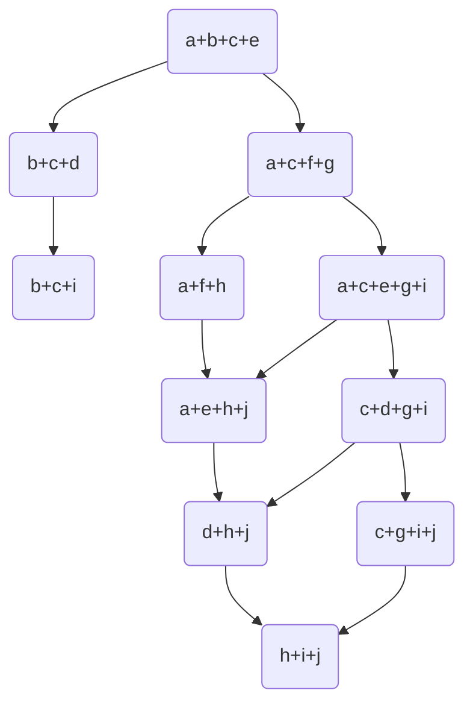

# Réseaux de petri coloré
graphe bi-partie, graphe à deux type de noeuds/arcs

### Rapels
réseau petri = quadruplet <P, T, W-, W+>

Exercice durant cours.

```mermaid
graph TB
0(a+b+c+e)-->1(b+c+d)
0-->2(a+c+f+g)
1-->3(b+c+i)
2-->4(a+f+h)
2-->5(a+c+e+g+i)
4-->6(a+e+h+j)
5-->6
5-->7(c+d+g+i)
6-->8(d+h+j)
7-->9(c+g+i+j)
7-->8
8-->10(h+i+j)
9-->10
```
