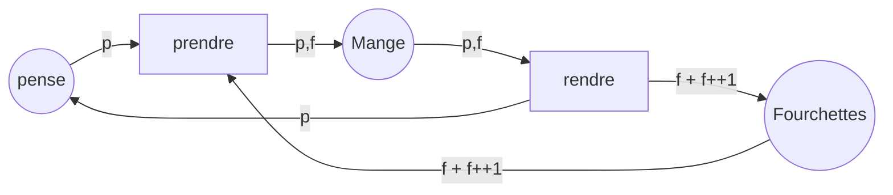
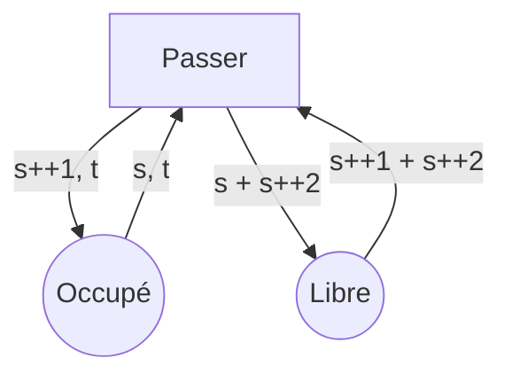
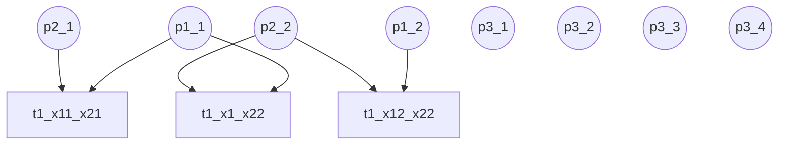

# Cours 3

### diner philosophes

0: <1 + 2, $\emptyset$, $\emptyset$, 1 + 2>
1: <1, 2, $\emptyset$, 1>
2: <1, $\emptyset$, 2, $\emptyset$>
3: <$\emptyset$, 1 + 2, $\emptyset$, $\emptyset$>
4: <2, 1, $\emptyset$, 2>

Interblocage possible.

**Q4:** pour résoudre le problème, prendre les 2 fourchettes en même temps.

**Q5:**
Prise des 2 fourchettes en même temps
0: <1 + 2, $\emptyset$, 1 + 2>
1: <2, 1, $\emptyset$>
2: <1, 2, $\emptyset$>

### Problème du train et des segments

Etat du système: Couple <numtrain, num section

0: < <1,1> + <4,2>, <2> + <3> + <5>>
1: < <2,1> + <4,2>, <1> + <3> + <5>>
2: < <2,1> + <5,2>, <2> + <3> + <4>>
3: < <3,1> + <5,2>, <1> + <2> + <4>>
...

**Q2: propriétées**
P1: le nombre de trains restent constants: Si toujours 2 trains dans l'état `occupé` alors toujours 2 trains dans le système. on ne résone pas sur les arcs, mais sur le graph de marquage.
en pertry net:
`query node (card(EtatSysteme) != 2)`

P2: On a jamais 2 fois le même S dans les jetons.
en petry net:
`query node (card(EtatSysteme:(Field[0] == 1)) > 1 ...)`

### Dépliage réseau de petri coloré

