# Structure kripke

### Exercice

$M \vDash \Phi$

$\Phi = FGc: \bot$
$\Phi = GFc: \top$
$\Phi = Ga: \bot$
$\Phi = aU(G(b\lor c)): \top$
$\Phi = X\lnot c \to XXc: \top$


### automates de Büchi

l'alphabet $\omega$ composé de ... est acceptant si il contient un nombre infinie de a, car l'automate lit un `a` pour sortir de 2 et aller dans 1, puis il reste dans 1 en lisant infiniement souvent 1.

On ne regarde pas les traces qui ne sont pas acceptante, que celle acceptantes.

**TEST:**
L(A) = ${\omega \in {a, b}^\omega | |w|_b = \omega }$

Réponse: $\Sigma^*.b^\omega$
Une suite finis de a suivi d'une infinité de b ou notre alphabet complet suivit d'une suite infinie de b.

### Exercice
construire automat buchi pour: p, Xp.
Lit: p
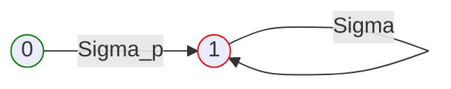

Lit: Xp
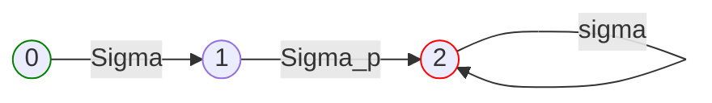

Lit: Fp
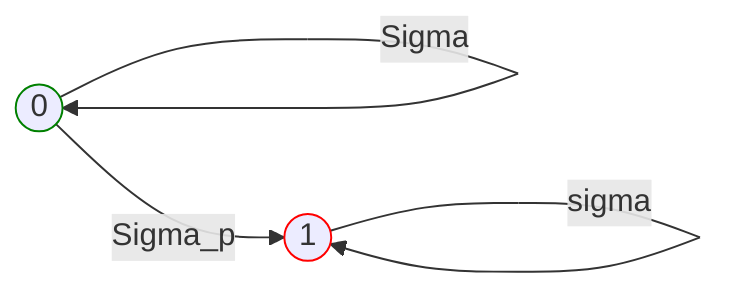

lit: XXp
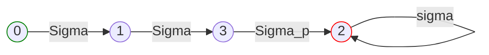

Lit: Gp
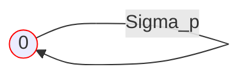

Lit: FGp
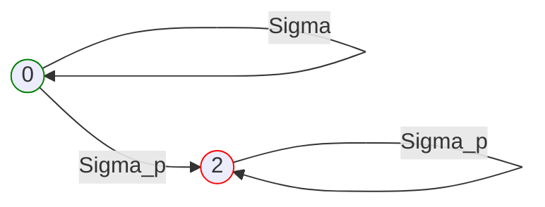

Lit: GFp
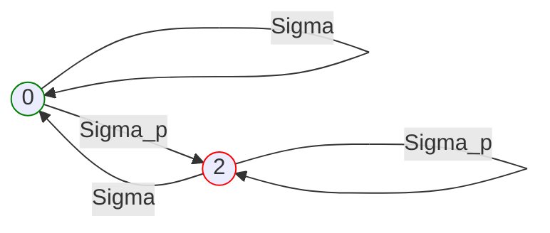

Lit: pUq
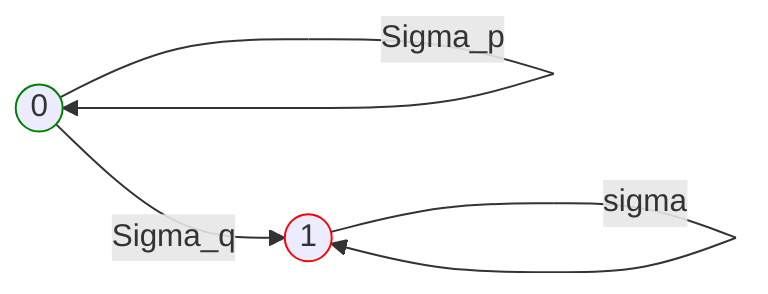

Lit: pRq
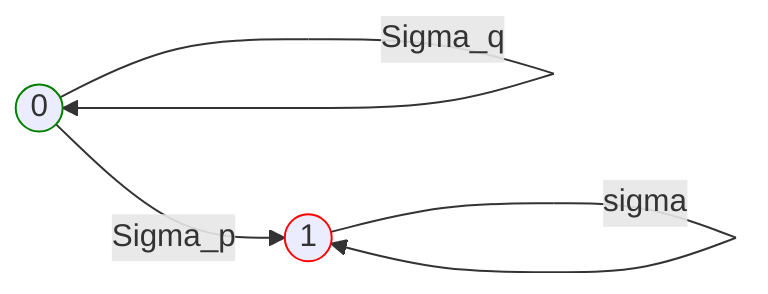

### Exercice

G(p-->Fq) ==> NNF

$(false R ( \lnot p \lor (true  U q)))$

lit aU(Xa)

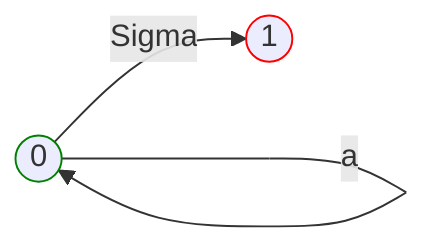

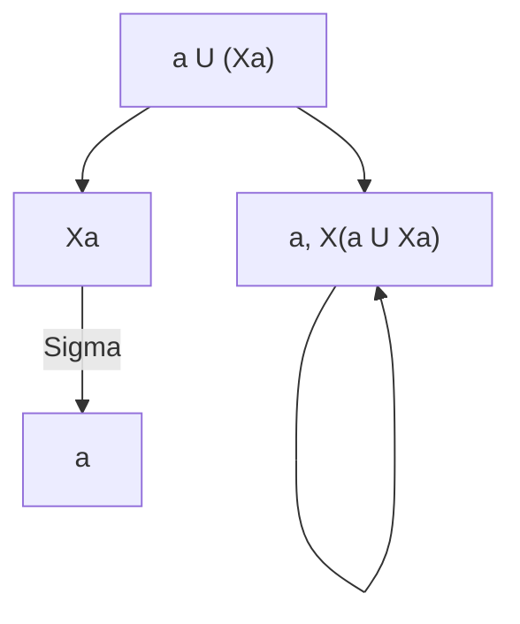

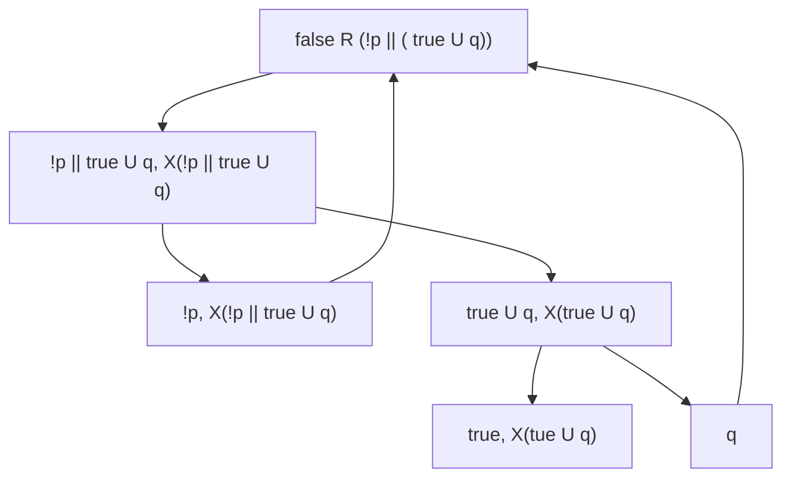

```wavedrom {align="center"}
{signal:
    [{name: "P1", wave: "x...l...", data: ["P1"]},
    {name: "P2", wave: "0...xxl.", date: ["P2"]}]}
```
